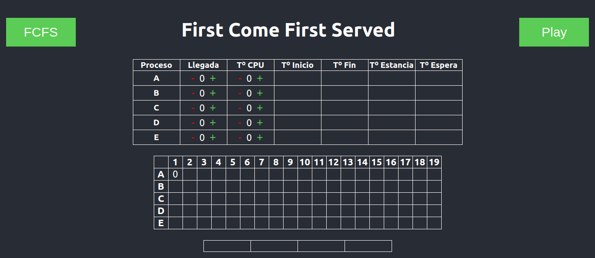

# Process Scheduler Simulator

This is a Process Scheduler Simulator made with React for the Operating Systems subject at Computer Science degree at the University of Cordoba.

It's already deployed on GitHub-Pages so if you want to see how does it works just visit the following link:

[https://marcosrigal.github.io/process-scheduler-simulator/#/](https://marcosrigal.github.io/process-scheduler-simulator/#/)